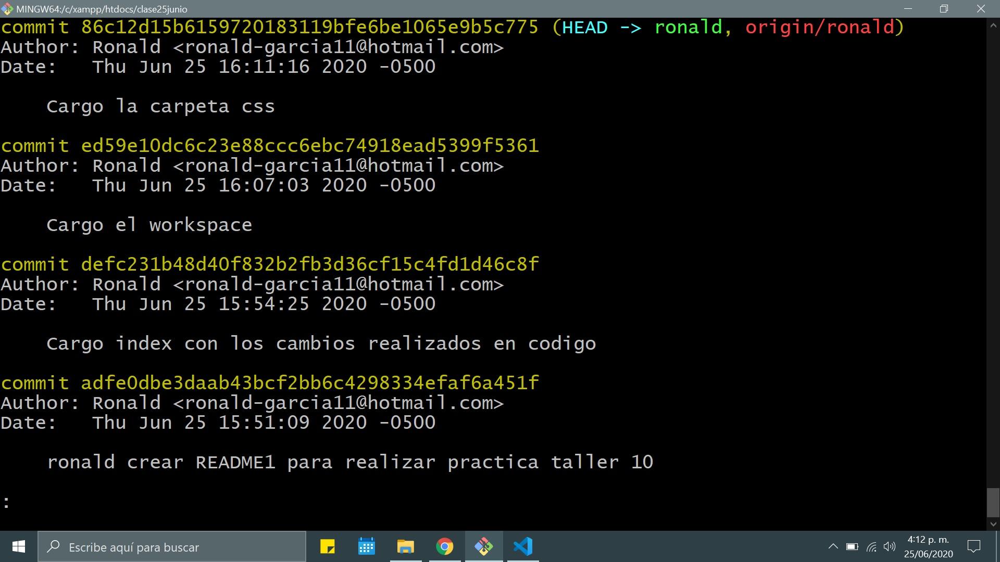
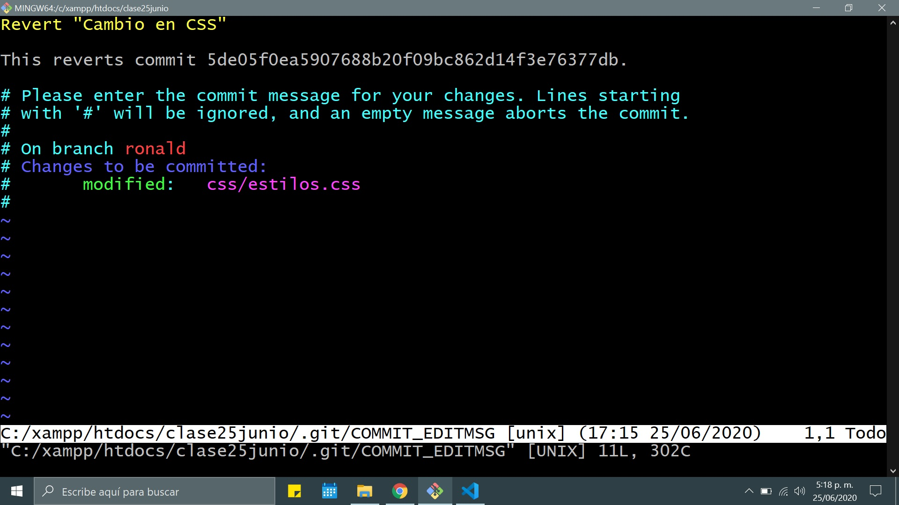
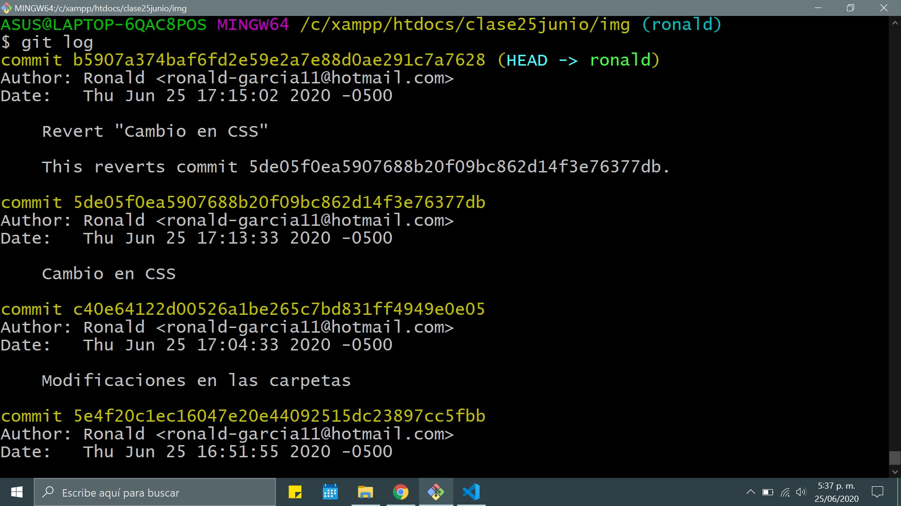
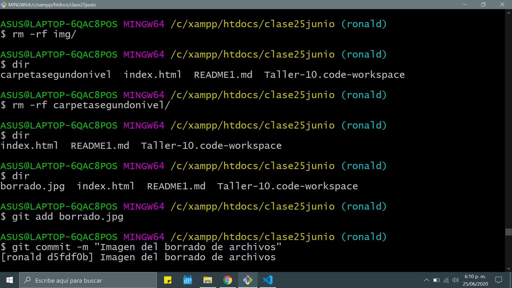
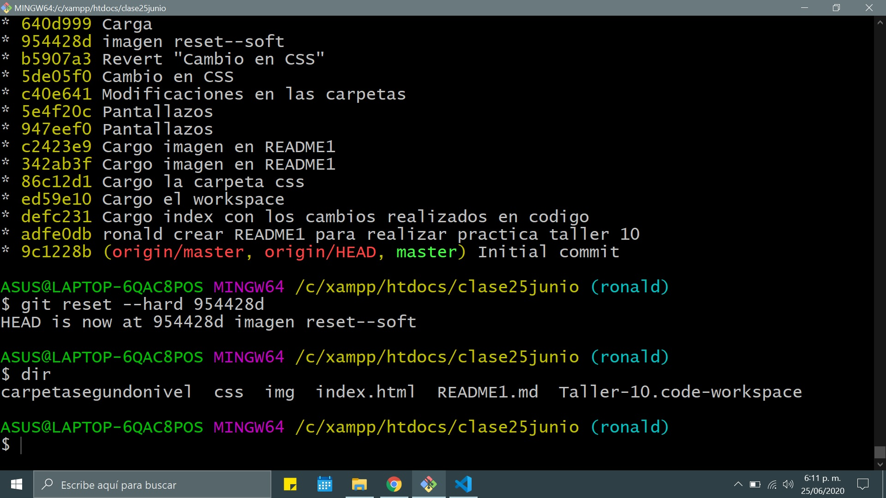

# Taller 10
## Trabajo Colaborativo

1. Pantallazo primeros commit

2. Pantallazo revert

3. Pantallazo git reset --soft

4. Pantallazo Commit borrando todos los archivos 

5. Pantallazo Reset --hard  recuperando archivos
